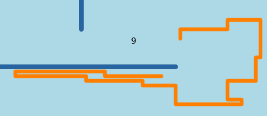

# Nibbles .NET (WinForms)

This is a simple Windows Forms game, developed in C#, based on Microsoft QBasic Nibbles. The first version of this project was hosted on GotDotNet. It has now been updated to be a Visual Studio 2005 project. View the Help Page. There will be no further enhancements to Nibbles .NET - all future development will be to add features to SilverNibbles (see below).

# SilverNibbles (Silverlight)

SilverNibbles is a port of Nibbles .NET to Silverlight 3.0. We have also taken advantage of the graphics capabilities of Silverlight to enhance the appearance slightly (while retaining a strong visual resemblance to the original). A recent version can be played below. You can also read some [development notes](developmentnotes.md).

# Help

The original [Nibbles](http://en.wikipedia.org/wiki/Nibbles_%28computer_game%29) game ran on [QBasic](http://en.wikipedia.org/wiki/Qbasic), which was supplied with early versions of Windows. Nibbles .NET is a port of the original QBasic code to run on any version of Windows with the .NET 2.0 framework or higher installed.

The object is simple, guide your snake around the screen using the cursor keys to collect numbers. With each number you collect, your snake grows longer, and your score increases. Once you have collected 10 numbers, you will progress to the next level. Your snake starts with 5 lives. A life is lost if you collide with a wall, your own tail, or, in two player mode, with the opponent snake.

Sammy (the first snake) is guided by the four cursor keys, whilst Jake (the second snake in two player mode) is guided by the following keys: **A** = left; **S** = down; **D** = right; **W** = up.

